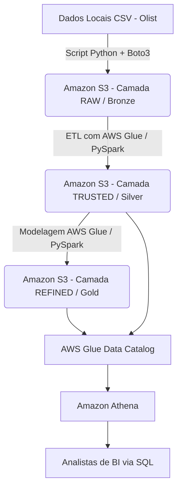

# AWS E-Commerce Data Lake (v1.0)

Este projeto implementa um pipeline completo de Engenharia de Dados na AWS focado em resolver problemas analíticos de um e-commerce em hipercrescimento. A arquitetura segue o modelo Medallion (Bronze, Silver e Gold) para construir um Data Lake escalável e sem servidor (Serverless), partindo da ingestão de dados brutos até a modelagem para consumo via SQL.

## O Problema de Negócio

A área de logística necessita de respostas rápidas para três perguntas críticas:

1. Quais são as rotas com maiores atrasos de entrega?
2. Como o custo do frete impacta o volume de vendas por região?
3. Como os atrasos afetam a pontuação de satisfação dos clientes?

O processamento tradicional em planilhas não suporta mais o volume de dados. A solução desenvolvida centraliza, limpa e modela as bases em um Data Lake na AWS.

## Fonte de Dados

O projeto utiliza o **[Brazilian E-Commerce Public Dataset by Olist](https://www.kaggle.com/datasets/olistbr/brazilian-ecommerce)** (disponível no Kaggle). É uma base relacional que simula a complexidade real de uma operação corporativa contendo tabelas de Pedidos, Clientes, Pagamentos, Produtos, Avaliações e Geolocalização.

## Arquitetura do Pipeline



## Stack Tecnológico

* **Linguagem:** Python 3 (Boto3, python-dotenv)
* **Storage:** Amazon S3 (Data Lake)
* **Processamento (Próximas fases):** AWS Glue (PySpark)
* **Consumo (Próximas fases):** Amazon Athena (Serverless SQL)
* **Gerenciamento de Acesso:** AWS IAM

## Estrutura de Diretórios

projeto-engenharia-dados-aws/
├── data/
│   ├── raw/                 # CSVs originais baixados do Kaggle (ignorado pelo git)
│   ├── trusted/             # Dados limpos (uso futuro local se necessário)
│   └── refined/             # Dados modelados (uso futuro local se necessário)
├── src/
│   ├── ingestion/
│   │   ├── __init__.py
│   │   └── upload_to_s3.py  # Script de ingestão da máquina local para a AWS
│   ├── transformation/      # Scripts Glue / PySpark (em breve)
│   └── analysis/            # Queries SQL do Athena (em breve)
├── .env.example             # Modelo das variáveis de ambiente (seguro para o Git)
├── .gitignore               # Proteção contra vazamento de chaves e dados pesados
└── README.md                # Documentação do projeto

## Preparação dos Dados

1. Baixe o dataset da Olist: [Brazilian E-Commerce Public Dataset by Olist](https://www.kaggle.com/datasets/olistbr/brazilian-ecommerce)

## Como Configurar e Executar (v1.0 - Ingestão)

Nesta primeira versão, o pipeline realiza a extração dos dados locais e o carregamento na camada Bronze (raw) do Amazon S3.

1. Pré-requisitos

   * Sistema Operacional Linux (ex: Arch Linux) ou similar.
   * AWS CLI instalado globalmente.
   * Python 3 instalado.
   * Conta na AWS com um usuário IAM configurado com a política AmazonS3FullAccess.
2. Clonando e Preparando o Ambiente

   ```
   # Clone o repositório
   git clone [https://github.com/SEU_USUARIO/projeto-engenharia-dados-aws.git](https://github.com/SEU_USUARIO/projeto-engenharia-dados-aws.git)
   cd projeto-engenharia-dados-aws

   # Crie e ative o ambiente virtual
   python -m venv .venv
   source .venv/bin/activate

   # Instale as dependências
   pip install boto3 python-dotenv
   ```
3. Configuração de Credenciais

   1. Crie um arquivo `.env` na raiz do projeto com base no modelo existente:

      ```
      cp .env.example .env
      ```
   2. Edite o arquivo `.env` inserindo as credenciais do seu usuário IAM e a região onde seu Bucket S3 foi criado:

      ```
      AWS_ACCESS_KEY_ID=sua_access_key_aqui
      AWS_SECRET_ACCESS_KEY=sua_secret_key_aqui
      AWS_REGION=us-east-1
      ```
4. Preparação dos Dados

   Abra o arquivo src/ingestion/upload_to_s3.py, verifique o nome do BUCKET_NAME apontando para o seu bucket real na AWS, e execute o script:

   ```
   python src/ingestion/upload_to_s3.py
   ```
   Você acompanhará via terminal o upload de cada entidade para a nuvem. Acesse o console do Amazon S3 para validar a criação dos objetos com o prefixo /raw.
